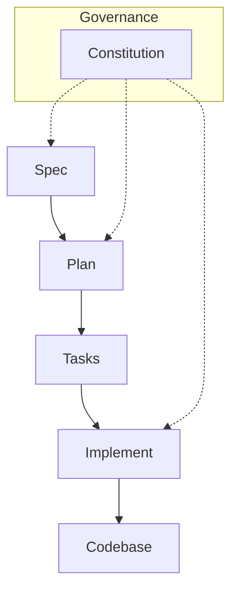

# Governance & Principles

## Intent & Learning Focus

This project is both to build an application and for learning SDD (Spec Driven Development), agentic coding, and Svelte. Best results are clear process and documented reasoning, not just a working demo.

## Process Rules

This project follows a **Spec-Driven Development (SDD)** methodology where documentation drives development. All work flows through these blueprint files:

- **constitution.md** (this file): Defines the governance, principles, and process rules for the project. It establishes the SDD workflow and coding standards that all development must follow.

  - _When to update_: When changing the development process, adding new rules, or modifying coding standards.

- **spec.md**: Contains all visitor and venue owner requirements, user stories, success criteria, and constraints. All features must be specified here before any planning or building begins. This is the single source of truth for what the application should do.

  - _When to update_: When adding new features, changing requirements, or refining user stories.

- **plan.md**: Documents all technical decisions, architecture choices, tech stack selections, and alternatives considered. Before implementing any feature, the technical approach must be documented here, including trade-offs and rationale.

  - _When to update_: After `spec.md` is updated, to define _how_ the feature will be built.

- **tasks.md**: Tracks all development tasks in a checklist format. Tasks are organized by category (Core, Decision/Exploration, Documentation) and checked off as completed. This provides visibility into project progress.

  - _When to update_: To break down the work defined in `plan.md` into actionable steps.

- **implement.md**: Logs all implementation actions, decisions made during coding, and notes from agentic coding sessions. This serves as a development journal that captures the "how" and "why" of implementation choices.

  - _When to update_: During the coding process to log progress, decisions, and outcomes.

**Workflow**: Every UI/feature must be built by first following the spec/plan sequence. "Vibe coding" (exploratory coding without documentation) is allowed only in dedicated experiments, which must be documented in implement.md or plan.md.

## Coding Standards

- Consistent Svelte style and clear commenting; use English for code, support i18n for UI as needed.

## Review Points

- After venue owner/editing prototype: reflect, discuss with agent, update documentation.

## Agentic Coding

- Let agent generate as much code and documentation as feasible; review and annotate all automated work.
