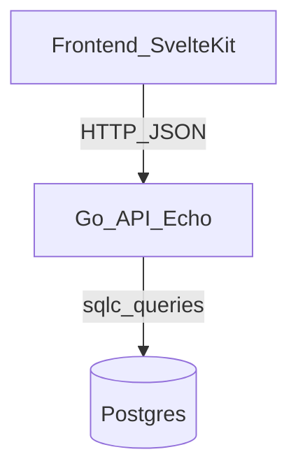

# Technical Plan (Backend)

## Tech Stack (decisions)

- **Language**: Go
- **HTTP router**: Echo (`github.com/labstack/echo/v4`)
- **Auth**: short-lived access JWT + refresh tokens
- **DB**: PostgreSQL
- **Migrations**: goose
- **DB access**: sqlc (no ORM; do not use gorm)
- **UUIDs**: `github.com/google/uuid` in application code; keep DB-specific UUID handling at the DB boundary (pgx/pgtype or adapter)
- **Containerized dev**: Dev Container (primary workflow) for consistent local development, using Rancher Desktop on macOS

## Architecture

### Layers

- **HTTP layer** (Echo handlers):
  - Parses/validates request JSON.
  - Auth middleware validates JWT and injects `owner_uuid` into request context.
  - Converts domain structs to response JSON.

- **Service layer**:
  - Authorization rules (ownership checks).
  - Higher-level operations (e.g. delete venue cascades).

- **Data access layer** (sqlc):
  - All SQL lives in `backend/db/queries/*.sql`.
  - sqlc generates query methods and DB types into `backend/db/sqlc` (proposed).

## Authentication & Authorization

### JWT + refresh tokens approach

- **Login/Register response** returns:
  - `access_token` (JWT; short-lived)
  - `owner` object (without password hash)
- **JWT claims** (proposed):
  - `sub`: `owner_uuid`
  - `iat`, `exp`
- **Token lifetime**:
  - access token: short-lived (e.g. 15 minutes)
  - refresh token: long-lived (e.g. 30 days), stored server-side (hashed) and rotated

#### Refresh tokens

- `POST /api/auth/refresh` issues a new access token when presented with a valid refresh token.
- `POST /api/auth/logout` invalidates the refresh token server-side; client discards access token.
- Recommended storage: refresh token in an **HttpOnly cookie** (so frontend JS cannot read it).

### Authorization rules

- Owner-only endpoints must ensure:
  - The requested resource is owned by `owner_uuid` from JWT context.
  - If ownership fails: `403 forbidden` (do not leak existence details).

## Database & migrations

### goose

- Migrations under `backend/db/migrations/`.
- Use `pgcrypto` (`gen_random_uuid()`) in migrations for DB-side UUID defaults.
- Ensure foreign keys have `on delete cascade` where appropriate.

### Data types

- `uuid` for primary keys and tokens (returned as strings in JSON).
- `timestamptz` for `created_at`, `modified_at`, and event `datetime`.
- `date` nullable for `event_lists.date`.

## sqlc

### Why sqlc

- Keeps the codebase ORM-free while remaining type-safe.
- SQL stays explicit and reviewable.

### Directory layout (proposed)

- `backend/db/migrations/` (goose)
- `backend/db/queries/` (`*.sql` for sqlc)
- `backend/db/sqlc/` (generated; committed or generated in CI—decision to be made)
- `backend/internal/`:
  - `internal/http/` Echo routes/handlers/middleware
  - `internal/service/` business logic
  - `internal/store/` glue around sqlc (optional if sqlc is used directly)

## Dev Container (local development)

### Goals

- Provide a consistent environment for Go + Postgres + migration tooling + sqlc generation.
- Reduce “works on my machine” drift and improve repeatability.

### Contents (proposed)

- Go toolchain
- `goose` binary
- `sqlc` binary
- Postgres service container

### Rancher Desktop notes

- Use standard Docker-compatible configuration; Dev Containers should work with Rancher Desktop as the container runtime.

## Coding standards (Go)

- Follow standard Go naming conventions:
  - `OwnerUUID`, `VenueUUID` in Go identifiers, but JSON tags remain `owner_uuid`, `venue_uuid`, etc.
  - Package names short, lowercase, no underscores.
- Keep DB-specific types confined to the data access boundary.

