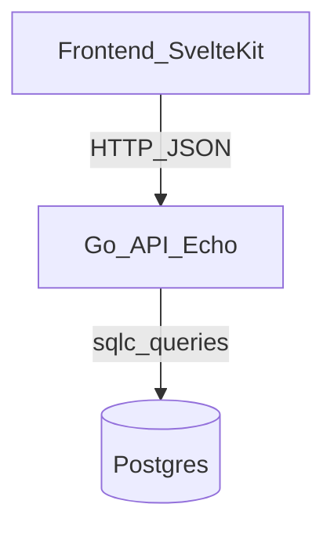

# Technical Plan (Backend)

## Tech Stack (decisions)

- **Language**: Go
- **HTTP router**: Echo (`github.com/labstack/echo/v4`)
- **Auth**: short-lived access JWT + refresh tokens
- **DB**: PostgreSQL
- **Migrations**: goose
- **DB access**: sqlc (no ORM; do not use gorm)
- **UUIDs**: `github.com/google/uuid` in application code; keep DB-specific UUID handling at the DB boundary (pgx/pgtype or adapter)
- **Containerized dev**: Dev Container (primary workflow) for consistent local development, using Rancher Desktop on macOS

## Architecture

### Layers

- **HTTP layer** (Echo handlers):
  - Parses/validates request JSON.
  - Auth middleware validates JWT and injects `owner_uuid` into request context.
  - Converts domain structs to response JSON.

- **Service layer**:
  - Authorization rules (ownership checks).
  - Higher-level operations (e.g. delete venue cascades).

- **Data access layer** (sqlc):
  - All SQL lives in `backend/db/queries/*.sql`.
  - sqlc generates query methods and DB types into `backend/db/sqlc` (proposed).

## Authentication & Authorization

### JWT + refresh tokens approach

- **Login/Register response** returns:
  - `access_token` (JWT; short-lived)
  - `owner` object (without password hash)
- **JWT claims** (proposed):
  - `sub`: `owner_uuid`
  - `iat`, `exp`
- **Token lifetime**:
  - access token: short-lived (e.g. 15 minutes)
  - refresh token: long-lived (e.g. 30 days), stored server-side (hashed) and rotated

#### Refresh tokens

- `POST /api/auth/refresh` issues a new access token when presented with a valid refresh token.
- `POST /api/auth/logout` invalidates the refresh token server-side; client discards access token.
- Recommended storage: refresh token in an **HttpOnly cookie** (so frontend JS cannot read it).

### Authorization rules

- Owner-only endpoints must ensure:
  - The requested resource is owned by `owner_uuid` from JWT context.
  - If ownership fails: `403 forbidden` (do not leak existence details).

## Database & migrations

### How goose + sqlc fit together (and the `backend/db/*` folders)

We separate **schema evolution**, **SQL query sources**, and **generated Go DB code**:

- `backend/db/migrations/` (**written by us**)
  - **Purpose**: the canonical history of schema changes (DDL): extensions, tables, indexes, constraints, triggers, etc.
  - **Tool**: `goose` applies these migrations to a Postgres database and records which ones have been applied.
  - **Depends on**: `backend/db/migrations/` + a target Postgres database.
  - **Produces**: a live DB schema (plus `goose_db_version` bookkeeping table in the DB).

- `backend/db/queries/` (**written by us**)
  - **Purpose**: the canonical SQL statements the application needs (CRUD, lookups, public browse, token resolution, refresh-token operations).
  - **Tool**: `sqlc` parses these queries and generates type-safe Go functions and parameter/result structs.
  - **Depends on**: the query text here **and** a schema source (configured in `sqlc.yaml`, via schema SQL files or DB introspection depending on our chosen configuration).

- `backend/db/sqlc/` (**generated by sqlc**)
  - **Purpose**: generated Go code that executes the SQL in `queries/` using `pgx` and provides type-safe APIs.
  - **Source**: `sqlc generate` output. (We will decide whether to commit generated code or generate it in CI; either way, it must stay in sync.)
  - **Produced by**: running `sqlc generate`.

Important: sqlc does **not** “run migrations” and does not inherently “read goose migrations” as a migration system. We keep the schema source used by sqlc aligned with the migrations we apply via goose.

#### Typical developer workflow (schema/query/code)

1. Add a new goose migration in `backend/db/migrations/` (schema change).
2. Apply migrations to your dev DB (`goose up`).
3. Update/add SQL in `backend/db/queries/` to match the new schema.
4. Regenerate sqlc (`sqlc generate`) so `backend/db/sqlc/` matches queries+schema.
5. Build/run the API.

#### Production / deployment usage

- **Schema updates** are applied by running goose against the production DB _as part of deployment_, **before** or **during** rollout of the new application version.
- Common deployment patterns:
  - **CI/CD step**: run `goose up` once, then deploy the new app.
  - **Kubernetes job/init container**: a single job applies migrations, then the app deploy proceeds.
  - Avoid having every app replica run migrations concurrently.
- Migrations should be written to support safe rollouts (prefer backwards-compatible changes when doing rolling deploys).

### goose

- Migrations under `backend/db/migrations/`.
- Use `pgcrypto` (`gen_random_uuid()`) in migrations for DB-side UUID defaults.
- Ensure foreign keys have `on delete cascade` where appropriate.

### Data types

- `uuid` for primary keys and tokens (returned as strings in JSON).
- `timestamptz` for `created_at`, `modified_at`, and event `datetime`.
- `date` nullable for `event_lists.date`.

## sqlc

### Why sqlc

- Keeps the codebase ORM-free while remaining type-safe.
- SQL stays explicit and reviewable.

### Directory layout (proposed)

- `backend/db/migrations/` (goose)
- `backend/db/queries/` (`*.sql` for sqlc)
- `backend/db/sqlc/` (generated; committed or generated in CI—decision to be made)
- `backend/internal/`:
  - `internal/http/` Echo routes/handlers/middleware
  - `internal/service/` business logic
  - `internal/store/` glue around sqlc (optional if sqlc is used directly)

## Local development (Dev Container)

### Goals

- Provide a consistent environment for Go + Postgres + migration tooling + sqlc generation.
- Reduce “works on my machine” drift and improve repeatability.

### Local dev workflow (keep Svelte HMR)

Even if in production the Go service serves the built frontend, local development should keep **SvelteKit/Vite HMR** by running the frontend dev server separately.

**Run two processes**:

- **Frontend (HMR)**: SvelteKit dev server on `http://localhost:5173`
- **Backend API**: Go/Echo on `http://localhost:8080` (example port)

**Make API calls look same-origin in dev** by proxying `/api` from the SvelteKit dev server to the Go backend:

- In dev, the browser calls `http://localhost:5173/api/...`
- Vite proxies that to `http://localhost:8080/api/...`

Benefits:

- Frontend retains full HMR.
- No CORS needed in local dev (the browser talks only to the SvelteKit origin).
- Refresh-token cookies (HttpOnly) work cleanly because requests are same-origin from the browser’s perspective.

**Proxy configuration**:

- Configure the SvelteKit/Vite dev server to proxy `/api` to the backend.
- In the frontend code, always call the API using **relative URLs** (e.g. `fetch('/api/auth/me')`) so the same code works in dev (proxied) and in production (served by Go).

### Contents (proposed)

- Go toolchain
- `goose` binary
- `sqlc` binary
- Postgres service container

### Rancher Desktop notes

- Use standard Docker-compatible configuration; Dev Containers should work with Rancher Desktop as the container runtime.

## Production on Render.com

We deploy a single Go web service that serves:

- **API** under `/api/...`
- **Frontend static assets** (built SvelteKit output) under `/` (and client-side routes fall back to `index.html`)

### Why

- Same-origin deployment simplifies:
  - refresh-token cookies (HttpOnly) without cross-site complications
  - CORS (generally not needed)
  - fewer services to configure

### Deployment flow (high level)

- Build the frontend into static assets.
- Bundle or copy the built frontend into the Go service image/artifact (so Echo can serve it).
- Run database migrations (goose) during deploy (CI step or Render deploy command).
- Start the Go service on Render (serving both `/` and `/api`).

### Relationship to local development

- **Production** serves frontend from Go.
- **Local dev** uses SvelteKit dev server with HMR and proxies `/api` to Go.
- Because frontend code uses **relative `/api` URLs**, the same frontend code works in both environments:
  - dev: `/api` is proxied
  - prod: `/api` is handled directly by Go

## Coding standards (Go)

- Follow standard Go naming conventions:
  - `OwnerUUID`, `VenueUUID` in Go identifiers, but JSON tags remain `owner_uuid`, `venue_uuid`, etc.
  - Package names short, lowercase, no underscores.
- Keep DB-specific types confined to the data access boundary.

## Deployment & production (Render.com + GitHub Actions)

### Render.com resources

We use Render.com for:

- **Web Service**: Go/Echo server (serves both `/` and `/api` for Option B).
- **PostgreSQL**: Render Postgres instance for persistent storage.

### CI/CD approach

We use GitHub Actions for CI and Render deploy hooks for CD:

- **CI (GitHub Actions)** on PRs and on `main`:
  - Build backend
  - Run unit/integration tests (as they exist)
  - (Optional) run `sqlc generate` and ensure the generated code is up-to-date

- **CD (Render deploy hook)**:
  - On merge to `main`, GitHub Actions triggers a Render **Deploy Hook** to deploy the Web Service.

### Database migrations in production

We run `goose up` against the Render Postgres database as part of deployment, before the new code starts handling traffic.

Recommended patterns:

- **Deploy command migration**: run migrations as the Render “Deploy Command” step (runs once per deploy), then start the service.
- **CI migration step**: GitHub Actions runs migrations (requires securely providing the DB URL) before triggering deploy.

Operational guidance:

- Prefer a single migration runner per deploy (avoid every replica running migrations concurrently).
- Keep migrations backwards-compatible for rolling deployments when possible.

