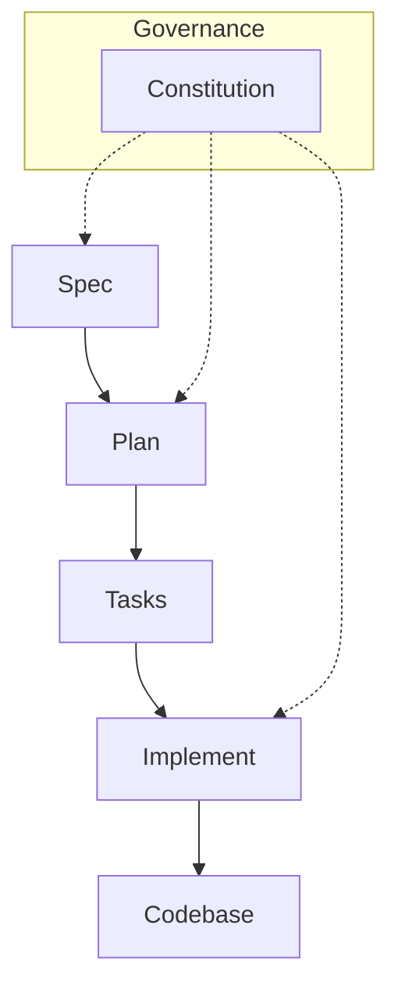

# Governance & Principles

## Intent & Learning Focus

This project is both to build an application and for learning SDD (Spec Driven Development), agentic coding, and Svelte. Best results are clear process and documented reasoning, not just a working demo.

## Process Rules

This project follows a **Spec-Driven Development (SDD)** methodology where documentation drives development. All work flows through these blueprint files:

- **constitution.md** (this file): Defines the governance, principles, and process rules for the project. It establishes the SDD workflow and coding standards that all development must follow.

  - _When to update_: When changing the development process, adding new rules, or modifying coding standards.

- **frontend/\***: Frontend blueprint documents.

  - **frontend/1_spec.md**: Contains all visitor and venue owner requirements, user stories, success criteria, and constraints.
  - **frontend/2_plan.md**: Documents frontend technical decisions, architecture choices, tech stack selections, and alternatives considered.
  - **frontend/3_tasks.md**: Tracks frontend development tasks in a checklist format.
  - **frontend/4_implement.md**: Frontend implementation log.

- **backend/\***: Backend blueprint documents.

  - **backend/1_spec.md**: Defines the backend requirements and API contract, and the database schema and migrations.
  - **backend/2_plan.md**: Documents backend architecture, stack decisions, and rationale.
  - **backend/3_tasks.md**: Tracks backend implementation tasks.
  - **backend/4_implement.md**: Backend implementation log.

**Workflow**: Every UI/feature must be built by first following the spec/plan sequence. "Vibe coding" (exploratory coding without documentation) is allowed only in dedicated experiments, which must be documented in the relevant `*_implement.md` or `*_plan.md`.

## Coding Standards

- Consistent Svelte style and clear commenting; use English for code, support i18n for UI as needed.

## Review Points

- After venue owner/editing prototype: reflect, discuss with agent, update documentation.

## Agentic Coding

- Let agent generate as much code and documentation as feasible; review and annotate all automated work.

